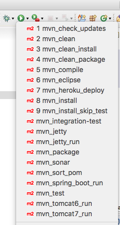
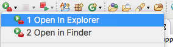

# Eclipse Support

Eclipse Support is a simple project that creates some useful links to run maven commands in eclipse.

This list of shortcuts is available in eclipse menu as below:

 

## How install?

Import the eclipse-support as Maven Project in eclipse

## How use?

Its simple! 
*	Select a resource in the project that you want run a maven command
*	Click on Run Menu and select the command

## External Commands

 

*	Open in Explorer(Windows): open the selected file(or folder) in Windows Explorer
*	Open in Finder(Mac): open the selected file(or folder) in Finder

