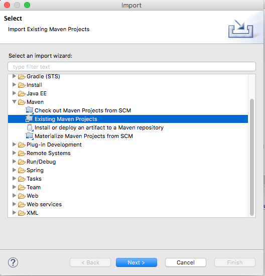

# Eclipse Support

Eclipse Support is a simple project that creates some useful links to run maven commands in eclipse.

## How install?

*	clone this repository
	
	git clone https://github.com/jonyfs/eclipse-support.git
	
*	Import the eclipse-support as Maven Project in eclipse

 

## How use?

*	Select a resource in the project that you want run a maven command
*	Click on Run Menu and select the command

## Maven Commands

This list of shortcuts is available in Eclipse Run Menu as below:

 

## External Commands

 

*	Open in Explorer(Windows): open the selected file(or folder) in Windows Explorer
*	Open in Finder(Mac): open the selected file(or folder) in Finder

